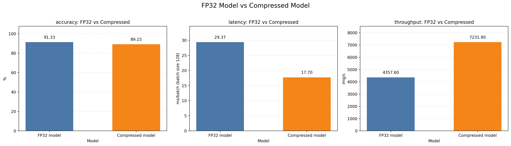

# IR50 RAF-DB Quantization

This project compresses an `IR50` facial expression recognition model fine-tuned on `RAF-DB` with a deployment-oriented pipeline:

`FP32 IR50 -> BRECQ PTQ -> ONNX(Q/DQ) -> TensorRT`

## Summary

This repo includes:

- `BRECQ`-based post-training quantization for `IR50`
- ONNX export for FP32 and quantized deployment wrappers
- explicit `Q/DQ` ONNX export for TensorRT
- TensorRT engine build, accuracy evaluation, and latency benchmarking

Current deployment comparison:

- FP32 TensorRT accuracy: `0.9133`
- W8A8 TensorRT accuracy: `0.8915`
- FP32 TensorRT latency: `29.37 ms/batch`
- W8A8 TensorRT latency: `17.70 ms/batch`
- accuracy drop: about `2.2%p`
- latency reduction: about `39.7%`




the comparisons are tested on RTX 4090
## Project Goal

The target setting is:

- dataset: `RAF-DB`
- backbone: `IR50`
- source model: fine-tuned FP32 checkpoint
- compression path: `BRECQ -> ONNX -> TensorRT`

This is not just a fake-quant research script. The repo also includes the deployment path needed to compare:

- original FP32 model
- quantized deployment model
- TensorRT latency and accuracy


## Installation

Recommended environment:

- `python=3.10`
- `CUDA 12.1`

Install the Python dependencies from the requirements file:

```bash
pip install -r requirements.txt
```

Use the requirements file as the source of truth for Python packages.

For TensorRT evaluation, you also need:

- NVIDIA GPU
- CUDA-compatible PyTorch
- TensorRT Python package

Depending on the machine, the repo can use either:

- `trtexec`
- Python TensorRT fallback

Notes:

- `trtexec` is not installed from `requirements.txt`; it comes from a TensorRT SDK install.
- If your local CUDA / TensorRT stack differs, install the matching PyTorch and TensorRT builds for your machine.
## Repository Layout

```text
quantization/
  calibration/   # BN folding and FP32 deployment wrappers
  ptq/           # BRECQ blocks, quant layers, optimizer
  exporter/      # ONNX / QDQ / TensorRT deployment wrappers
  run_brecq.py   # BRECQ entrypoint
  run_tensorrt.py

shells/
  quantization.sh
  quantization_legacy.sh
  quantization_legacy_w8a8.sh
  tensorrt_ir50.sh

imgs/
  model_comparison.png
```


## Default Checkpoints and Data

The shell scripts assume these defaults:

- FP32 checkpoint: `checkpoint/raf-ir50/best_acc.pth`
- RAF-DB path: `../data/RAF-DB_balanced`

Override them with environment variables if needed:

```bash
CKPT_PATH=/path/to/best_acc.pth \
DATASET_PATH=/path/to/RAF-DB_balanced \
bash shells/quantization.sh
```

## Quantization Commands

### 1. Stable BRECQ Run

Runs the default `stable` BRECQ profile.

```bash
bash shells/quantization.sh
```

Default profile:

- `W4A8`
- `BRECQ_PROFILE=stable`
- activation init: `percentile`
- regularization reduction: `mean`

Main output:

- quantized checkpoint: `checkpoint/ir50_w4a8_brecq_stable.pth`
- log file: `logs/quantization/...`

### 2. Reproduce the W8A8 Result

Runs the legacy `W8A8` sweep-style setting used for deployment comparison.

```bash
bash shells/quantization_legacy_w8a8.sh
```

This produces:

- quantized checkpoint: `checkpoint/ir50_w8a8_brecq_legacy_sweep.pth`

That checkpoint is the input to the ONNX/TensorRT path below.

## ONNX / TensorRT Commands

### 1. Full FP32 vs W8A8 Deployment Comparison

```bash
bash shells/tensorrt_ir50.sh
```

This script runs the full pipeline:

1. export FP32 IR50 to ONNX
2. export quantized IR50 to Q/DQ ONNX
3. build FP32 TensorRT engine
4. build quantized TensorRT engine
5. evaluate FP32 TensorRT accuracy
6. evaluate quantized TensorRT accuracy
7. benchmark FP32 TensorRT latency
8. benchmark quantized TensorRT latency

Default outputs:

- `checkpoint/deploy/w8a8_legacy/ir50_fp32.onnx`
- `checkpoint/deploy/w8a8_legacy/ir50_w8a8_qdq.onnx`
- `checkpoint/deploy/w8a8_legacy/ir50_fp32.engine`
- `checkpoint/deploy/w8a8_legacy/ir50_w8a8_qdq.engine`
- `checkpoint/deploy/w8a8_legacy/ir50_w8a8_qdq_report.json`

### 2. Important Note on the ONNX Export

The TensorRT path uses an explicit `Q/DQ` ONNX graph.

That means:

- the graph is exported with `QuantizeLinear / DequantizeLinear`
- TensorRT recognizes it as an explicit quantization graph
- for the current path, the runtime ONNX tensor type is `INT8`

So this deployment path is best described as:

- BRECQ-trained quantized semantics
- exported to explicit `Q/DQ` ONNX
- wrapped for TensorRT deployment

## Direct CLI Entry Points

If you want to run individual steps instead of the shell wrappers:

```bash
python -m quantization.run_brecq
python -m quantization.run_tensorrt export-onnx
python -m quantization.run_tensorrt build-engine
python -m quantization.run_tensorrt eval-pytorch
python -m quantization.run_tensorrt eval-trt
python -m quantization.run_tensorrt benchmark-pytorch
python -m quantization.run_tensorrt benchmark-trt
```

## Notes

- `BRECQ` in this repo is a `PTQ` method, not full QAT.
- The deployment pipeline includes extra work beyond fake quantization:
  - state restoration
  - Q/DQ ONNX export
  - TensorRT engine generation
  - accuracy / latency validation
- If you modify exporter logic, rebuild both:
  - `.onnx`
  - `.engine`

## Quick Start

If you only want the main comparison:

```bash
# 1) Reproduce the W8A8 quantized checkpoint
bash shells/quantization_legacy_w8a8.sh

# 2) Export and compare in TensorRT
bash shells/tensorrt_ir50.sh
```
