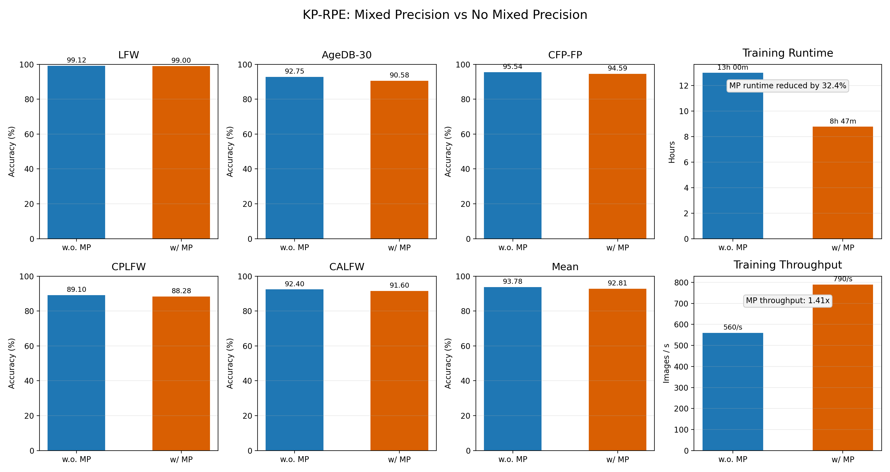

# FaceRecognition

This repository is a research-oriented face recognition pipeline built around KP-RPE training and evaluation.

The project has two goals:

- make KP-RPE training faster through mixed precision and multi-GPU support
- make the codebase easier to extend by keeping the training, preprocessing, dataset, and evaluation pipelines more explicit and controllable

The code is structured so that changing one part of the pipeline is less likely to require ad-hoc edits across the whole repository. In practice, that means:

- dataset handling is centralized through a registry
- preprocessing is separated from training
- training and evaluation entrypoints are explicit
- accelerator/FSDP and standard DDP paths are both supported

This README reflects the current public-facing policy:

- you are expected to prepare datasets yourself
- this repository only documents how already-prepared datasets should be arranged and used
- upstream checkpoints are not redistributed here
- dataset access and usage permissions remain the user's responsibility

## Benchmark Snapshot

The figure below compares two KP-RPE small training runs on CASIA aligned:

- `w.o. MP`: standard DDP, global batch `512`
- `w/ MP`: BF16 mixed precision with `Accelerate + FSDP`, global batch `512`



Verification summary:

| Metric | w.o. MP | w/ MP |
| --- | ---: | ---: |
| LFW | 99.1167 | 99.0000 |
| AgeDB-30 | 92.7500 | 90.5833 |
| CFP-FP | 95.5429 | 94.5857 |
| CPLFW | 89.1000 | 88.2833 |
| CALFW | 92.4000 | 91.6000 |
| Mean | 93.7819 | 92.8105 |
| Training runtime | 13h 00m | 8h 47m |
| Training throughput | 560 img/s | 790 img/s |

In this comparison, mixed precision reduced training runtime by `32.4%` and increased throughput to `1.41x`, while the no-mixed-precision run retained slightly higher verification accuracy.

## 1. Upstream Provenance

The `models/` and `aligners/` packages in this repository are derived from the official KPRPE repository:

- https://github.com/mk-minchul/kprpe

They were then adapted here so the overall face recognition pipeline is easier to read, modify, and extend for local research work.

This repository does not redistribute upstream pretrained checkpoints. If you need KP-RPE or aligner checkpoints, obtain them from the official KPRPE repository and the resources linked from it:

- https://github.com/mk-minchul/kprpe

## 2. Environment

Use the Docker image below:

```bash
docker pull 18101224/cuda129-rpe:latest
```

Run a container:

```bash
docker run -it --rm --gpus all --ipc=host \
  -e WANDB_API_KEY="${WANDB_API_KEY:-}" \
  -v "/path/to/FaceRecognition:/workspace" \
  -v "/data:/data" \
  -w /workspace \
  18101224/cuda129-rpe:latest \
  bash
```

Assumptions used throughout this README:

- the repository is mounted at `/workspace`
- datasets are mounted under `/data`
- commands are executed from `/workspace`

## 3. Repository Scope

This repository covers:

- dataset loading
- MTCNN-based face alignment preprocessing
- KP-RPE training
- mixed precision and multi-GPU training
- verification evaluation

This repository intentionally does not cover:

- mirrored downloads
- redistribution of dataset archives or benchmark files
- dataset licensing guidance

For any dataset used here, prepare it separately and place it under your own local data root.

## 4. Data Preparation

Dataset layouts, preprocessing commands, and verification-set preparation are documented separately:

- [dataset/README.md](dataset/README.md)

Use that document for:

- supported dataset names
- expected training dataset layouts
- face alignment preprocessing
- verification dataset conversion and readiness checks

## 5. Training

The current training defaults are fixed in code:

- optimizer: `AdamW`
- scheduler: cosine
- warmup: `3` epochs

Runtime paths:

- `--use_accelerator false`: regular DDP path
- `--use_accelerator true`: `Accelerate + FSDP`

This repository does not use a DeepSpeed backend.

Before running the training commands below, place the required aligner checkpoint under a local path such as:

```text
/workspace/checkpoint/adaface_vit_base_kprpe_webface12m
```

Obtain that checkpoint from the official KPRPE repository and the resources linked from it:

- https://github.com/mk-minchul/kprpe

### 5.1 CASIA, KP-RPE small, without mixed precision

This command uses 2 GPUs and keeps the global batch size at `512`.

```bash
RUN_ID=casia-kprpe-small-nomp CUDA_VISIBLE_DEVICES=0,1 \
torchrun --nproc_per_node=2 --standalone train.py \
  --dataset_name casia \
  --dataset_root /data/mj/casia-webface-aligned \
  --aligner_ckpt /workspace/checkpoint/adaface_vit_base_kprpe_webface12m \
  --architecture kprpe_small \
  --embedding_dim 512 \
  --classifier fc \
  --batch_size 512 \
  --n_epochs 100 \
  --learning_rate 1e-3 \
  --weight_decay 0.05 \
  --h 0.333 \
  --mixed_precision no \
  --use_accelerator false \
  --use_flash_attn false \
  --rpe_impl extension
```

### 5.2 CASIA, KP-RPE small, BF16 with Accelerate + FSDP

This command uses 2 GPUs and matches the effective global batch of the no-MP run above.

```bash
RUN_ID=casia-kprpe-small-bf16 CUDA_VISIBLE_DEVICES=2,3 \
torchrun --nproc_per_node=2 --standalone train.py \
  --dataset_name casia \
  --dataset_root /data/mj/casia-webface-aligned \
  --aligner_ckpt /workspace/checkpoint/adaface_vit_base_kprpe_webface12m \
  --architecture kprpe_small \
  --embedding_dim 512 \
  --classifier fc \
  --batch_size 256 \
  --n_epochs 100 \
  --learning_rate 1e-3 \
  --weight_decay 0.05 \
  --h 0.333 \
  --mixed_precision bf16 \
  --use_accelerator true \
  --use_flash_attn false \
  --rpe_impl extension
```

Checkpoint output:

```text
/workspace/checkpoint/<RUN_ID>/
```

Each run stores:

- `best/`
- `last/`
- `train_state.r*.pt`

### 5.3 Resume training

```bash
CUDA_VISIBLE_DEVICES=0,1 torchrun --nproc_per_node=2 --standalone train.py \
  --resume_path /workspace/checkpoint/<RUN_ID>/last \
  --dataset_name casia \
  --dataset_root /data/mj/casia-webface-aligned \
  --aligner_ckpt /workspace/checkpoint/adaface_vit_base_kprpe_webface12m \
  --architecture kprpe_small \
  --embedding_dim 512 \
  --classifier fc \
  --batch_size 512 \
  --n_epochs 150 \
  --learning_rate 1e-3 \
  --weight_decay 0.05 \
  --h 0.333 \
  --mixed_precision no \
  --use_accelerator false \
  --use_flash_attn false \
  --rpe_impl extension
```

Note:

- `--n_epochs` is the total target epoch count, not “additional epochs”

## 6. Evaluation

### 6.1 Evaluate one checkpoint

```bash
bash shells/eval_nompi_only.sh \
  /workspace/checkpoint/<RUN_ID> \
  best \
  /data/mj/facerec_val \
  /workspace/checkpoint/adaface_vit_base_kprpe_webface12m \
  256 \
  4 \
  cuda:0 \
  lfw agedb_30 cfp_fp cplfw calfw
```

This wrapper:

- exports the checkpoint to `model.exported.pt` if needed
- runs verification evaluation on the requested datasets

### 6.2 Compare mixed precision vs no mixed precision

```bash
bash shells/eval_mp_vs_nompi.sh \
  /workspace/checkpoint/<MP_RUN_ID> \
  /workspace/checkpoint/<NO_MP_RUN_ID> \
  best \
  /data/mj/facerec_val \
  /workspace/checkpoint/adaface_vit_base_kprpe_webface12m \
  256 \
  4 \
  true \
  lfw agedb_30 cfp_fp cplfw calfw
```

This wrapper:

- exports each checkpoint to `model.exported.pt` if needed
- evaluates both checkpoints sequentially
- reuses exported models on later runs

### 6.3 Re-train an MP checkpoint and compare immediately

```bash
bash shells/retrain_mp_then_eval.sh \
  mp-bf16-fixed \
  /workspace/checkpoint/<NO_MP_RUN_ID> \
  best
```

This wrapper:

- trains a fresh BF16 + accelerator checkpoint
- saves it to `/workspace/checkpoint/mp-bf16-fixed`
- exports it
- evaluates it against an existing no-MP checkpoint

## 7. Checkpoint Caveat

Old accelerator/FSDP checkpoints saved before the full-state save fix may not be evaluable from `model.pt` alone.

Typical failure signs:

- flattened parameter tensors instead of full parameter shapes
- zero-sized tensors in the saved state dict
- export or eval failures caused by local-shard shape mismatches

If that happens, do not use that checkpoint for final comparison. Re-train or re-save the model with the current code.

New accelerator checkpoints created with the current training code save the backbone through `accelerator.get_state_dict(...)`, which is the correct path for later export and evaluation.

## 8. Manual Utilities

Check verification dataset readiness:

```bash
python tools/check_eval_ready.py --root /data/mj
```

Export a non-accelerator checkpoint manually:

```bash
python tools/export_eval_model.py \
  --checkpoint_dir /workspace/checkpoint/<RUN_ID> \
  --checkpoint_tag best \
  --output_path /workspace/checkpoint/<RUN_ID>/best/model.exported.pt
```

Export an accelerator/FSDP checkpoint manually:

```bash
CUDA_VISIBLE_DEVICES=2,3 torchrun --nproc_per_node=2 --standalone \
  tools/export_eval_model.py \
  --checkpoint_dir /workspace/checkpoint/<RUN_ID> \
  --checkpoint_tag best \
  --output_path /workspace/checkpoint/<RUN_ID>/best/model.exported.pt
```

Run evaluation directly:

```bash
python eval_verification.py \
  --checkpoint_dir /workspace/checkpoint/<RUN_ID> \
  --checkpoint_tag best \
  --model_path /workspace/checkpoint/<RUN_ID>/best/model.exported.pt \
  --aligner_ckpt /workspace/checkpoint/adaface_vit_base_kprpe_webface12m \
  --eval_root /data/mj/facerec_val \
  --datasets lfw agedb_30 cfp_fp cplfw calfw \
  --batch_size 256 \
  --num_workers 4 \
  --mixed_precision no \
  --use_flash_attn false \
  --device cuda:0
```
